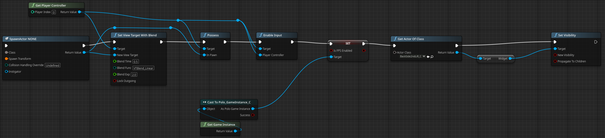

## What is In Bloom

In Bloom was intended to be a survival horror game where nature has taken over

## My Experience

Not one of my favorite projects

The end result looks quite good but I did not like it either as a concept or as a game.

The game was fine to implement nothing major technical issues I could have really prevented,
we did however have issues communicating ideas during this project, partially due to people missing
and just information lost between disciplines.

We used fmod and suffered from a lot of issues on that front to begin with.

Unreal had some issues when we were using it, like a example would be how when Perforce was down 
Unreal would also freeze until Perforce was back, though that is more of a Perforce issue than a Unreal one.
The issues we encountered with Unreal was mostly that it was not really that intuitive, like 
why is it (x, y, z) but also (x, z, y) when going from C++ to blueprints

### My Takeaways
- Reinforced that communication is key
- Fmod is a pain
- Unreal was surprisingly annoying to work in

#### Systems I worked on

I made the interaction system (Opening Doors, Picking up items and storing items)

Blueprint test image

</img>

<!--  -->