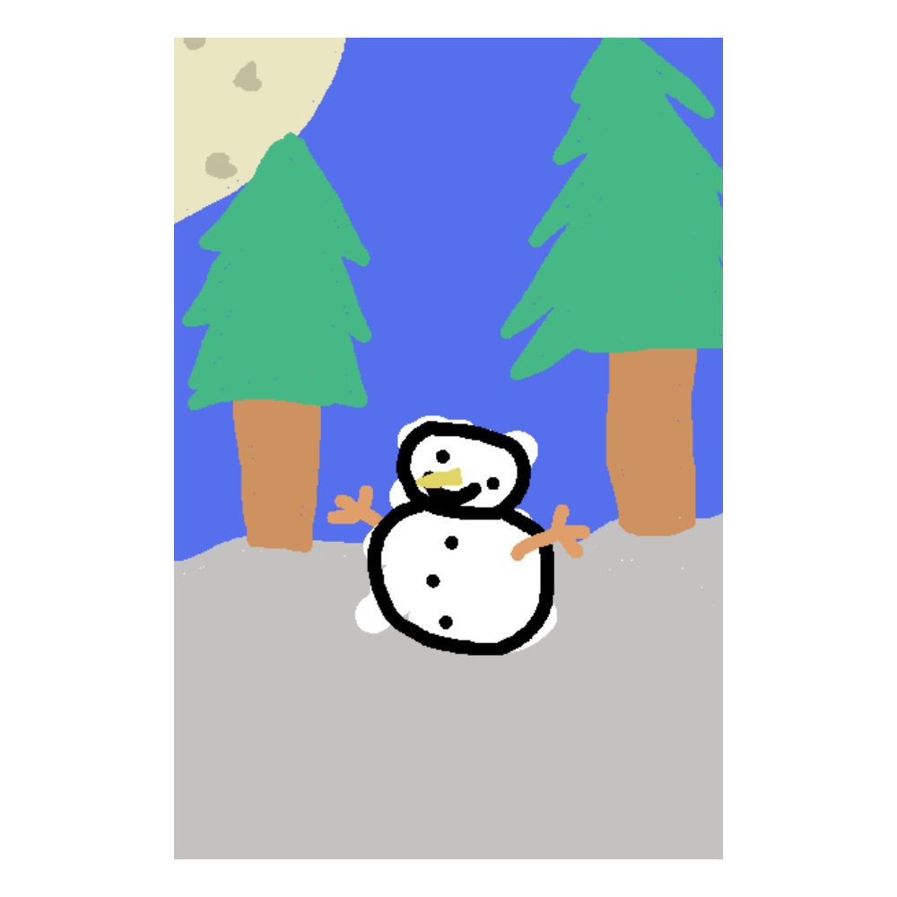
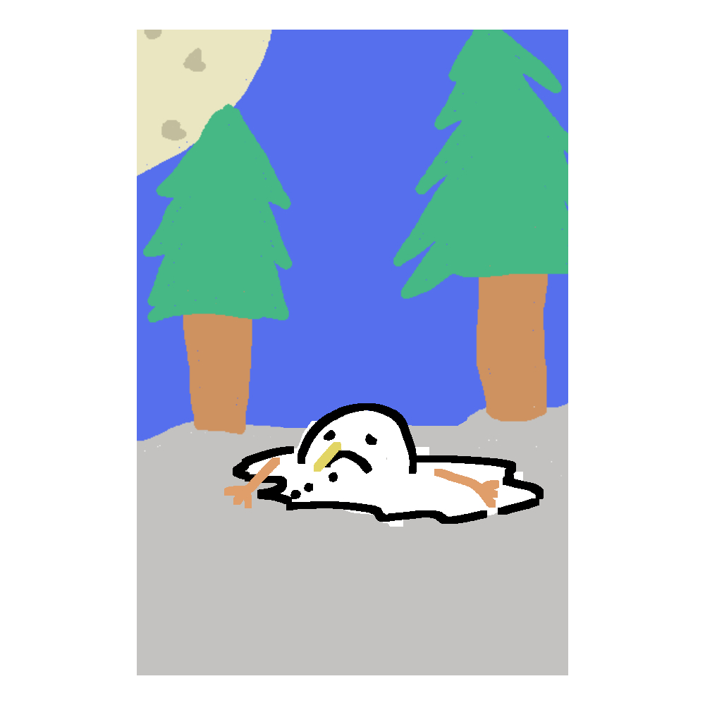

# Coming Soon

## Trailer
<iframe 
    src="https://www.youtube-nocookie.com/embed/n-CLQhPSjEc?si=xzWejycV9njthC4K" 
    title="Project Liminal" 
    frameborder="0" 
    <!--allow="accelerometer; autoplay; clipboard-write; encrypted-media; gyroscope; picture-in-picture; web-share" -->
    referrerpolicy="strict-origin-when-cross-origin" 
    allowfullscreen
>
</iframe>

## What Is Project Liminal

Project Liminal is a school project that was intended to be a game that is re-playable.
The way we tried to make that was via a friend-slop game where the goal is to under pressure identify anomalies.
The way these anomalies reveal themselves is that you and your friend will not be seeing the same thing. 

#### Visual Example:

    </img>
    </img>

In this example a randomly selected player might see the first or second image displayed on a painting in the game.
While the others see the other example.

This project was done 100% in blueprints due to the extreme time constraints

### My Takeaways
- Syncing Multiplayer Is Hard
- In A Small Team Vibes Can Carry You To Success
- Unreal Has Some Weird Issues
<!--That You Would Not Expect From Such A Big Engine -->

#### Systems I worked on

- Anomalies/Syncing The Wrong Visuals
- Triggers  
- Win Condition/Score
- Enemy AI/Behavior
<!--- The Trigger For Timer And Music-->
<!--- Ending Trigger-->

#### Anomaly Systems

The way it ended up working is overly convoluted since it was our first time doing multiplayer and we were trying to do something 
that is a bit working against what UE5 tries to do when syncing objects online, since we wanted the paintings to be synced in some ways but not all ways

### Triggers

I was in charge of implementing triggers for things like music timer and endings, and also making sure the triggers are synced for both players.
